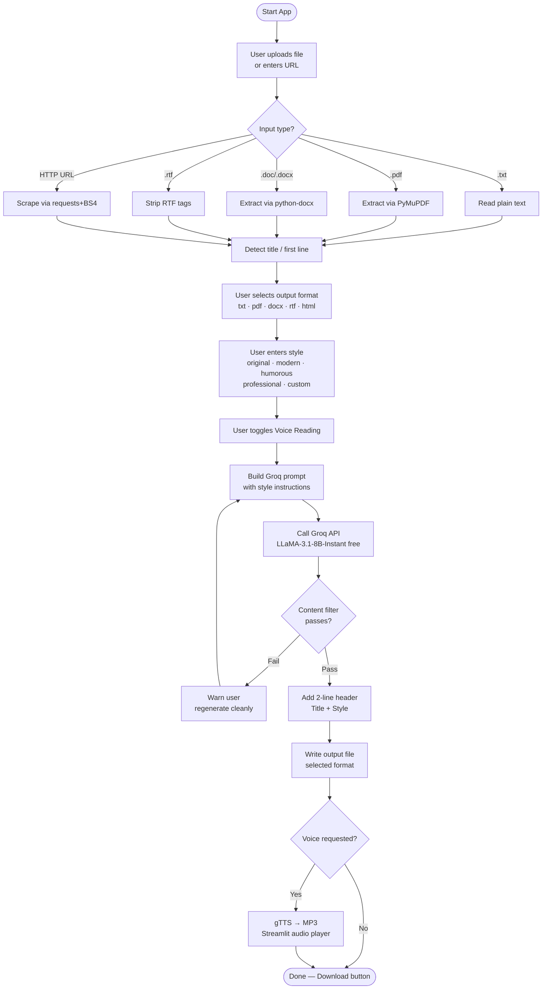

# Capstone Text Digest 📄

A Streamlit web application that transforms documents and web pages into polished, styled summaries using the Groq AI API — completely free to run.

---

## Features

- **Multiple input formats** — upload `.txt`, `.pdf`, `.doc/.docx`, or `.rtf` files, or paste any HTTP URL
- **AI-powered summarization** — powered by Groq's `llama-3.1-8b-instant` model (free tier)
- **Writing styles** — choose from Original, Modern, Humorous, Professional, Academic, Casual, or type any custom style (e.g. "Hemingway", "Gen-Z", "pirate")
- **Target reduction control** — toggle a slider to set a precise output reduction (10–90%), or let Groq decide automatically
- **Live input statistics** — word count, character count, and estimated output size shown before generating
- **Multiple output formats** — download the digest as `.txt`, `.pdf`, `.docx`, `.rtf`, or `.html`
- **Content safety filter** — automatically checks and cleans inappropriate language before delivery
- **Voice reading** — optional text-to-speech via Google TTS (gTTS), with MP3 download
- **Digest preview** — read the full output on screen before downloading

---

## Architecture

```
┌──────────────────────────────────────────────────────┐
│                  STREAMLIT FRONTEND                  │
│  ┌──────────────┐   ┌─────────────┐  ┌───────────┐   │
│  │  File Upload │   │  URL Input  │  │  Settings │   │
│  └──────┬───────┘   └──────┬──────┘  └─────┬─────┘   │
│         └──────────────────┴───────────────┘         │
│                            │                         │
│              ┌─────────────▼─────────────┐           │
│              │      input_handler.py     │           │
│              │  (parse .txt/.pdf/.doc/   │           │
│              │   .rtf / HTTP URL)        │           │
│              └─────────────┬─────────────┘           │
│                            │ raw text                │
│              ┌─────────────▼─────────────┐           │
│              │      groq_client.py       │           │
│              │  (summarize + style via   │           │
│              │   Groq LLaMA-3 free API)  │           │
│              └─────────────┬─────────────┘           │
│                            │ digest text             │
│              ┌─────────────▼─────────────┐           │
│              │    content_filter.py      │           │
│              │  (profanity / policy      │           │
│              │   safety check)           │           │
│              └─────────────┬─────────────┘           │
│                    ┌───────┴────────┐                │
│                    │ Safe? Yes / No │                │
│                    └───┬───────┬───┘                 │
│                   Yes  │       │ No                  │
│         ┌──────────────▼──┐  ┌─▼───────────────┐     │
│         │ output_writer.py│  │ Warn + re-prompt│     │
│         │ (txt/pdf/docx/  │  └─────────────────┘     │
│         │  rtf/html)      │                          │
│         └──────┬──────────┘                          │
│                │                                     │
│         ┌──────▼──────────┐                          │
│         │  tts_engine.py  │  ← optional              │
│         │  (gTTS → MP3)   │                          │
│         └──────┬──────────┘                          │
│                │                                     │
│         ┌──────▼──────────┐                          │
│         │  Download/Play  │                          │
│         │  in Streamlit   │                          │
│         └─────────────────┘                          │
└──────────────────────────────────────────────────────┘
```

### Flowchart



---

## Directory Structure

```
Capstone_text_digest/
├── .env                    # GROQ_API_KEY (never commit!)
├── .gitignore
├── README.md
├── implementation.md
├── pyproject.toml          # UV project config
├── requirements.txt        # pip-compatible fallback
│
├── src/
│   ├── app.py              # Streamlit entry point
│   ├── input_handler.py    # Parse all input formats
│   ├── groq_client.py      # Groq API wrapper
│   ├── content_filter.py   # Profanity / safety check
│   ├── output_writer.py    # Write txt/pdf/docx/rtf/html
│   └── tts_engine.py       # gTTS voice reading
│
├── tests/
│   ├── test_input_handler.py
│   ├── test_groq_client.py
│   └── test_content_filter.py
│
├── assets/
│   └── sample_input.txt    # Quick demo file
│
└── output_files/           # Generated digests land here
```

---

## Setup

### Prerequisites

- Python 3.11+
- [UV](https://github.com/astral-sh/uv) package manager
- A free [Groq API key](https://console.groq.com)

### 1 — Install UV

```bash
# macOS / Linux
curl -LsSf https://astral.sh/uv/install.sh | sh

# Windows (PowerShell)
powershell -ExecutionPolicy ByPass -c "irm https://astral.sh/uv/install.ps1 | iex"
```

### 2 — Clone and set up the environment

```bash
git clone https://github.com/YOUR_USERNAME/Capstone_text_digest.git
cd Capstone_text_digest
uv venv
source .venv/bin/activate   # Linux/macOS
# .venv\Scripts\activate    # Windows
```

### 3 — Install dependencies

```bash
uv add streamlit groq python-dotenv pymupdf python-docx \
       striprtf beautifulsoup4 requests fpdf2 \
       gtts better-profanity lxml
```

### 4 — Configure your API key

Create a `.env` file in the project root:

```bash
echo 'GROQ_API_KEY=gsk_your_key_here' > .env
```

Get your free key at [console.groq.com](https://console.groq.com) — no credit card required.

---

## Running the App

```bash
# Standard
uv run streamlit run src/app.py

# Custom port
uv run streamlit run src/app.py --server.port 8502
```

Open your browser at **http://localhost:8501**

---

## Usage

1. **Upload** a document or paste a URL into the input area
2. Review the **live input statistics** (word count, character count, estimated output size)
3. In the **sidebar**, choose your output style and format
4. Optionally toggle **"Set target output reduction"** and drag the slider to control digest length
5. Click **Generate Digest**
6. Read the **digest preview** on screen, then download in your chosen format
7. Enable **Voice Reading** in the sidebar to also get an MP3 audio version

---

## Module Reference

| Module | Responsibility |
|---|---|
| `app.py` | Streamlit UI, session state, orchestration |
| `input_handler.py` | Parse `.txt`, `.pdf`, `.docx`, `.rtf`, and URLs |
| `groq_client.py` | Build prompts, call Groq API, handle retries |
| `content_filter.py` | Profanity and safety check via `better-profanity` |
| `output_writer.py` | Write digest to `.txt`, `.pdf`, `.docx`, `.rtf`, `.html` |
| `tts_engine.py` | Convert digest to MP3 via gTTS |

---

## Troubleshooting

| Problem | Fix |
|---|---|
| `ModuleNotFoundError` | Run `uv sync` or `uv add <package>` |
| Groq 401 error | Check `.env` has the correct `GROQ_API_KEY` value |
| `GROQ_API_KEY` missing warning on startup | Make sure `.env` is in the project root, one level above `src/` |
| PDF extraction returns empty text | File may be a scanned image — OCR is not included in this version |
| Unicode characters crash PDF output | Already handled — `output_writer.py` sanitizes text before writing |
| gTTS network error | gTTS requires an internet connection — check connectivity |
| Streamlit port already in use | Add `--server.port 8502` to the run command |
| RTF output appears garbled | Ensure the source file is a genuine RTF, not a renamed `.doc` |
| Content filter false positives | Adjust the `better_profanity` wordlist in `content_filter.py` |

---

## Tech Stack

| Component | Technology |
|---|---|
| UI framework | [Streamlit](https://streamlit.io) |
| LLM API | [Groq](https://groq.com) — `llama-3.1-8b-instant` (free tier) |
| PDF parsing | [PyMuPDF](https://pymupdf.readthedocs.io) |
| DOCX parsing | [python-docx](https://python-docx.readthedocs.io) |
| RTF parsing | [striprtf](https://github.com/joshy/striprtf) |
| Web scraping | [requests](https://requests.readthedocs.io) + [BeautifulSoup4](https://www.crummy.com/software/BeautifulSoup/) |
| PDF generation | [fpdf2](https://py-fpdf2.readthedocs.io) |
| Text-to-speech | [gTTS](https://gtts.readthedocs.io) |
| Content safety | [better-profanity](https://github.com/snguyenthanh/better_profanity) |
| Package manager | [UV](https://github.com/astral-sh/uv) |

---

## License

MIT — see [LICENSE](LICENSE) for details.
