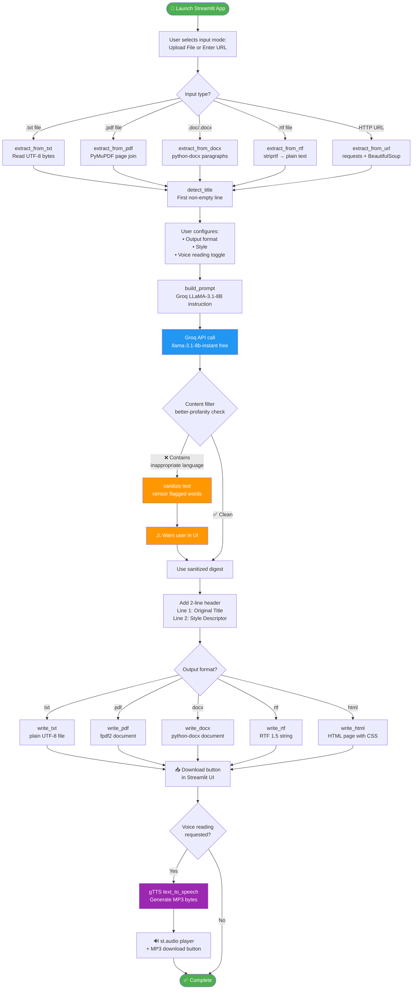

# Capstone_text_digest — Program Flowchart

This file contains the Mermaid diagram source for the application flow.
GitHub renders Mermaid diagrams natively in Markdown files.

## Data Flow Summary

| Stage | Module | Input | Output |
|---|---|---|---|
| 1. Extract | `input_handler.py` | File / URL | `(title, body)` strings |
| 2. Summarize | `groq_client.py` | title, body, style, api_key | Digest string |
| 3. Filter | `content_filter.py` | Digest string | `(bool, safe_string)` |
| 4. Write | `output_writer.py` | header1, header2, body, format | File path |
| 5. Read aloud | `tts_engine.py` | Full text string | MP3 bytes |
| 6. Display | `app.py` | All of the above | Streamlit UI elements |
