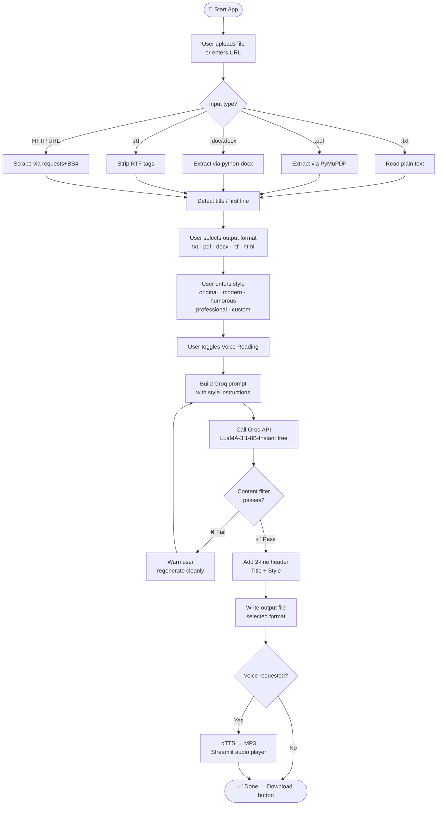

# Capstone_text_digest — Implementation Plan

> **Stack:** Python 3.11+ · UV · Streamlit · Groq AI (free tier) · gTTS · Mermaid flowchart

---

## Table of Contents

1. [Project Overview](#project-overview)
2. [Architecture & Flowchart](#architecture--flowchart)
3. [Directory Structure](#directory-structure)
4. [Environment Setup](#environment-setup)
5. [Step-by-Step Build Guide](#step-by-step-build-guide)
6. [Module Breakdown](#module-breakdown)
7. [Running the Application](#running-the-application)
8. [GitHub Publishing](#github-publishing)
9. [Troubleshooting](#troubleshooting)

---

## Project Overview

**Capstone_text_digest** is a Streamlit web application that:

- Accepts input as `.txt`, `.pdf`, `.doc/.docx`, `.rtf`, or a live HTTP URL
- Sends the text to Groq's free LLM API for intelligent summarization
- Applies a user-chosen writing style (original, modern, humorous, professional, or any custom style)
- Validates output for inappropriate language before delivery
- Outputs the digest as `.txt`, `.pdf`, `.docx`, `.rtf`, or displays it as an HTML page
- Prepends a two-line header: original title on line 1, adaptation style on line 2
- Optionally reads the summary aloud using gTTS (Google Text-to-Speech, free)

---

## Architecture & Flowchart

```
┌──────────────────────────────────────────────────────┐
│                  STREAMLIT FRONTEND                  │
│  ┌──────────────┐   ┌─────────────┐  ┌───────────┐  │
│  │  File Upload │   │  URL Input  │  │  Settings │  │
│  └──────┬───────┘   └──────┬──────┘  └─────┬─────┘  │
│         └──────────────────┴───────────────┘         │
│                            │                         │
│              ┌─────────────▼─────────────┐           │
│              │      input_handler.py     │           │
│              │  (parse .txt/.pdf/.doc/   │           │
│              │   .rtf / HTTP URL)        │           │
│              └─────────────┬─────────────┘           │
│                            │ raw text                │
│              ┌─────────────▼─────────────┐           │
│              │      groq_client.py       │           │
│              │  (summarize + style via   │           │
│              │   Groq LLaMA-3 free API)  │           │
│              └─────────────┬─────────────┘           │
│                            │ digest text             │
│              ┌─────────────▼─────────────┐           │
│              │    content_filter.py      │           │
│              │  (profanity / policy      │           │
│              │   safety check)           │           │
│              └─────────────┬─────────────┘           │
│                    ┌───────┴────────┐                │
│                    │ Safe? Yes / No │                │
│                    └───┬───────┬───┘                 │
│                   Yes  │       │ No                  │
│         ┌──────────────▼──┐  ┌─▼───────────────┐    │
│         │ output_writer.py│  │ Warn + re-prompt │    │
│         │ (txt/pdf/docx/  │  └─────────────────┘    │
│         │  rtf/html)      │                          │
│         └──────┬──────────┘                          │
│                │                                     │
│         ┌──────▼──────────┐                          │
│         │  tts_engine.py  │  ← optional              │
│         │  (gTTS → MP3)   │                          │
│         └──────┬──────────┘                          │
│                │                                     │
│         ┌──────▼──────────┐                          │
│         │  Download/Play  │                          │
│         │  in Streamlit   │                          │
│         └─────────────────┘                          │
└──────────────────────────────────────────────────────┘
```

### Mermaid Flowchart (for GitHub rendering)



---

## Directory Structure

```
Capstone_text_digest/
├── .env                    # GROQ_API_KEY (never commit!)
├── .gitignore
├── README.md
├── implementation.md       ← this file
├── cheatsheet.md
├── reference.md
├── pyproject.toml          # UV project config
├── requirements.txt        # pip-compatible fallback
│
├── src/
│   ├── app.py              # Streamlit entry point
│   ├── input_handler.py    # Parse all input formats
│   ├── groq_client.py      # Groq API wrapper
│   ├── content_filter.py   # Profanity / safety check
│   ├── output_writer.py    # Write txt/pdf/docx/rtf/html
│   └── tts_engine.py       # gTTS voice reading
│
├── tests/
│   ├── test_input_handler.py
│   ├── test_groq_client.py
│   └── test_content_filter.py
│
├── docs/
│   └── flowchart.md        # Mermaid diagram source
│
├── assets/
│   └── sample_input.txt    # Quick demo file
│
└── output_files/           # Generated digests land here
```

---

## Environment Setup

### 1 — Install UV

```bash
# macOS / Linux
curl -LsSf https://astral.sh/uv/install.sh | sh

# Windows (PowerShell)
powershell -ExecutionPolicy ByPass -c "irm https://astral.sh/uv/install.ps1 | iex"
```

### 2 — Create project & virtual environment

```bash
uv init Capstone_text_digest
cd Capstone_text_digest
uv venv                   # creates .venv/
source .venv/bin/activate # Linux/macOS
# .venv\Scripts\activate  # Windows
```

### 3 — Install dependencies

```bash
uv add streamlit groq python-dotenv pymupdf python-docx \
       striprtf beautifulsoup4 requests reportlab fpdf2 \
       gtts better-profanity lxml
```

### 4 — Get free Groq API key

1. Visit https://console.groq.com
2. Sign up (free, no credit card required)
3. Dashboard → API Keys → Create Key
4. Copy the key

### 5 — Create `.env`

```bash
echo 'GROQ_API_KEY=gsk_your_key_here' > .env
```

---

## Step-by-Step Build Guide

### Step 1 — Project scaffold

```bash
mkdir -p src tests docs assets output_files
touch src/app.py src/input_handler.py src/groq_client.py \
      src/content_filter.py src/output_writer.py src/tts_engine.py
touch tests/test_input_handler.py
touch .env .gitignore README.md
```

### Step 2 — `.gitignore`

```
.env
.venv/
__pycache__/
*.pyc
output_files/
*.mp3
.DS_Store
```

### Step 3 — `src/input_handler.py`

Responsibilities:
- Accept `UploadedFile` object from Streamlit OR a URL string
- Dispatch to the correct parser based on extension / MIME type
- Return `(title: str, body: str)` tuple

Key libraries: `pymupdf` (PDF), `python-docx` (DOCX), `striprtf` (RTF), `requests + BeautifulSoup` (URL)

### Step 4 — `src/groq_client.py`

Responsibilities:
- Build a system prompt that embeds the chosen style
- Send `title + body` to Groq's `llama-3.1-8b-instant` model
- Return the digest string
- Handle API errors gracefully

Free model options (as of 2025): `llama-3.1-8b-instant`, `gemma2-9b-it`, `mixtral-8x7b-32768`

### Step 5 — `src/content_filter.py`

Responsibilities:
- Use `better-profanity` to scan the digest
- If flagged, add a note and re-request a clean version from Groq
- Return `(is_safe: bool, cleaned_text: str)`

### Step 6 — `src/output_writer.py`

Responsibilities:
- Accept `(header_line1, header_line2, body, format)` 
- Write to `output_files/` and return the file path
- Formats: `.txt` (plain), `.pdf` (fpdf2), `.docx` (python-docx), `.rtf` (manual RTF), `.html` (f-string template)

### Step 7 — `src/tts_engine.py`

Responsibilities:
- Accept text string
- Generate MP3 with gTTS
- Return MP3 bytes for Streamlit `st.audio()`

### Step 8 — `src/app.py` (Streamlit UI)

Responsibilities:
- Sidebar: API key input (overrides .env), style picker, format picker, voice toggle
- Main area: file uploader OR URL text box
- Progress spinner during Groq call
- Display digest in `st.text_area`
- Download button for output file
- Audio player if voice is enabled

### Step 9 — Tests

```bash
uv add --dev pytest
uv run pytest tests/ -v
```

### Step 10 — Run

```bash
uv run streamlit run src/app.py
```

---

## Module Breakdown

### `input_handler.py` — Key functions

| Function | Description |
|---|---|
| `extract_from_txt(file)` | Read UTF-8 text file |
| `extract_from_pdf(file)` | PyMuPDF page concatenation |
| `extract_from_docx(file)` | python-docx paragraph join |
| `extract_from_rtf(file)` | striprtf → plain text |
| `extract_from_url(url)` | requests + BS4 `<p>` extraction |
| `parse_input(source)` | Router — calls the right extractor |
| `detect_title(text)` | Returns first non-empty line |

### `groq_client.py` — Key functions

| Function | Description |
|---|---|
| `build_prompt(title, body, style)` | Constructs the LLM instruction |
| `summarize(title, body, style, api_key)` | Calls Groq, returns digest |
| `_safe_retry(prompt, api_key)` | Retry with clean-style flag |

### `content_filter.py` — Key functions

| Function | Description |
|---|---|
| `is_clean(text)` | Returns bool via better-profanity |
| `sanitize(text)` | Replaces flagged words with `***` |
| `check_and_clean(text)` | Returns `(bool, str)` tuple |

### `output_writer.py` — Key functions

| Function | Description |
|---|---|
| `write_txt(header1, header2, body)` | Plain text file |
| `write_pdf(header1, header2, body)` | fpdf2 document |
| `write_docx(header1, header2, body)` | python-docx document |
| `write_rtf(header1, header2, body)` | RTF string manually |
| `write_html(header1, header2, body)` | HTML page string |
| `write_output(...)` | Dispatcher |

### `tts_engine.py` — Key functions

| Function | Description |
|---|---|
| `text_to_speech(text, lang='en')` | Returns MP3 BytesIO |
| `get_audio_bytes(text)` | Wrapper for Streamlit |

---

## Running the Application

```bash
# Development
uv run streamlit run src/app.py

# With a specific port
uv run streamlit run src/app.py --server.port 8502

# Production (disable file watcher)
uv run streamlit run src/app.py --server.runOnSave false
```

Open browser at: **http://localhost:8501**

---

## GitHub Publishing

```bash
# 1. Initialize git (already done by uv init, but just in case)
git init
git add .
git commit -m "feat: initial Capstone_text_digest implementation"

# 2. Create repo on GitHub (via CLI)
gh repo create Capstone_text_digest --public --source=. --remote=origin

# OR manually on github.com, then:
git remote add origin https://github.com/YOUR_USERNAME/Capstone_text_digest.git
git branch -M main
git push -u origin main
```

### Recommended GitHub files

- `README.md` — project description, screenshot, setup steps
- `LICENSE` — MIT recommended
- `.github/workflows/ci.yml` — optional GitHub Actions for pytest

---

## Troubleshooting

| Problem | Fix |
|---|---|
| `ModuleNotFoundError` | Run `uv sync` or `uv add <pkg>` |
| Groq 401 error | Check `.env` has correct `GROQ_API_KEY` |
| PDF extraction empty | File may be scanned image; OCR not included in MVP |
| gTTS network error | gTTS requires internet; check connection |
| Streamlit port in use | `--server.port 8502` |
| RTF garbled output | Ensure source file is proper RTF, not renamed DOC |
| Content filter false positives | Adjust `better_profanity` wordlist in `content_filter.py` |
